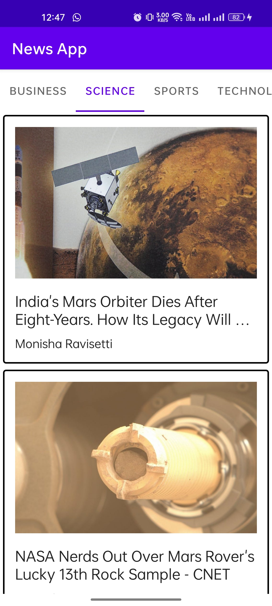
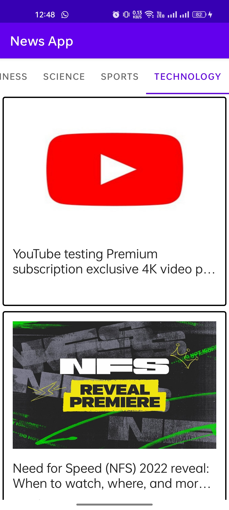

# News App

News App is an Android app developed to display up to date news to the users.

## Features
- Users can see up to date news.
- Users can see news articles according to various categories.
- Users can see full article in Chrome Custom tabs.

## Android Architecture Components
- Fragments
- ViewPager with TabLayout
- JSON Parsing
- CardView
- RecyclerView

## API
News Api from newsapi.org is used for fetching up to date news.

## About App
  
**Fit Me** app is divided into mainly 4 tab layouts - .

- **1. Business** - Users can see current Business category news in this section.
- **2. Science** - Users can see current Science category news in this section.
- **3. Sports** - Users can see current Sports category news in this section.
- **4. Technology** - Users can see current Technology category news in this section.
  
  
||||
|:----------------------------------------:|:-----------------------------------------:|:-----------------------------------------: |
|  |  |  | 
|  |  |  |

## Architecture
This app uses [***MVVM (Model View View-Model)***](https://developer.android.com/jetpack/docs/guide#recommended-app-arch) architecture.

 

 ## Contact
If you need any help, you can connect with me.

Email - baibhavrajputt@gmail.com
